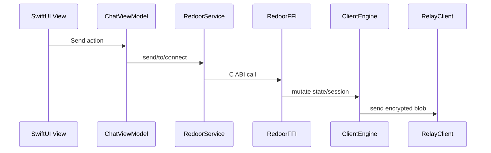

# Object-Oriented Design

For the expanded enterprise low-level/OO design, patterns, and UML views, see [`docs/enterprise/LOW_LEVEL_AND_OO_DESIGN.md`](docs/enterprise/LOW_LEVEL_AND_OO_DESIGN.md) and [`docs/enterprise/UML.md`](docs/enterprise/UML.md).

## 1. Scope
This document maps the object model used across Swift (app layer), Rust (runtime), and Go (relay service), with emphasis on responsibilities, collaboration, and security-critical behavior.

## 2. Swift Application Object Model (`RedoorApp`)

### 2.1 Core Types
- `RedoorService` (`Services/RedoorService.swift`)
  - Facade over networking, identity, messaging, session, and security services.
  - Owns app-level reactive state (`isConnected`, `isLocked`, `isDuressMode`, messages).
- `NetworkService`, `IdentityService`, `MessagingService`, `SessionService`, `SecurityService`
  - Focused micro-services behind `RedoorService`.
- `ChatService`
  - UI-facing wrapper that adapts `RedoorService` to view-model consumption.
- `ChatViewModel`
  - Presentation model for setup/chat flows; binds UI controls to domain actions.
- `SecureStorage`, `HMACKeyStore`
  - Volatile key-value storage abstraction (RAM-only policy).

### 2.2 Design Patterns
- Facade: `RedoorService` simplifies FFI-heavy operations.
- Service composition: domain actions split by responsibility.
- MVVM: SwiftUI views -> `ChatViewModel` -> `ChatService`/`RedoorService`.
- Observer/Reactive: `@Published` state + Combine pipelines.

## 3. Rust Runtime Object Model (`client`)

### 3.1 Core Types
- `ClientEngine` (`client/src/engine.rs`)
  - Runtime root object with async runtime + synchronized `AppState`.
- `AppState`
  - Aggregate state container (clients, identity, sessions, queues, flags, buffers).
- `SessionEntry`
  - Per-peer ratchet/session material.
- `StoredMessage`, `InnerPayload`, `Envelope`
  - Message and transport value objects.
- `RelayClient`
  - Transport client with HMAC/TLS pinning/blinding logic.

### 3.2 Design Patterns
- Aggregate root: `ClientEngine` controls mutation boundaries.
- Policy-driven behavior: strict anonymity, fixed polling, cover traffic toggles.
- Adapter/bridge: FFI functions in `ffi.rs` expose stable C ABI for Swift.
- Defensive boundary checks: input validation and panic guards (`ffi_guard_*`).
- Regression-gate objects: diagnostics value objects provide deterministic anonymity metric reports consumed by CI gate binaries.

### 3.3 Concurrency
- Shared mutable state via `Arc<Mutex<AppState>>`.
- Fine-grained feature flags via atomics (`AtomicBool`, `AtomicU64`, etc.).
- Background jobs executed on Tokio runtime.

## 4. Go Relay Object Model (`relay-node`)

### 4.1 Core Types
- `EphemeralStore` (`storage/ephemeral_storage.go`)
  - In-memory blob store with receiver index and TTL cleanup.
- `RateLimiter` (`network/ratelimit.go`)
  - Per-IP token bucket middleware.
- `KeyStore` (network package)
  - HMAC key holder with optional runtime rotation.

### 4.2 Design Patterns
- Middleware composition: rate limit and security wrappers over handlers.
- Repository-like storage abstraction: `Store`, `Retrieve`, `RetrieveNextByReceiver`.
- Strategy-like relay path: store locally or forward via mix next-hop.

## 5. Cross-Layer Object Collaboration

## 6. Security-Critical Object Contracts
- `RedoorService.lock()` and duress handlers must clear user-facing runtime state.
- `NetworkConfigValidator` must reject insecure remote relay settings.
- `ClientEngine::secure_wipe()` must clear messages, sessions, caches, and queues.
- `RelayClient` must blind receiver IDs and verify transport pinning/HMAC when configured.

## 7. Extension Points
- Alternate UI clients can reuse FFI surface (`ffi.rs`).
- Additional relay routing strategies can be plugged through onion/mix configuration.
- Policy toggles (`strict anonymity`, `cover traffic`, `background mode`) are already modeled as runtime flags.

## 8. Refactoring Priorities
- Reduce unused legacy modules in Rust client to keep the object graph minimal.
- Continue extracting protocol-level interfaces for improved unit-testability.
- Keep lifecycle wipe contracts centralized and regression-tested.

## 9. Open Source Tracking
Contributor-facing implementation status is tracked in `docs/OPEN_SOURCE_STATUS.md`.
This document intentionally avoids duplicating issue state so design notes do not drift from the project tracker.
