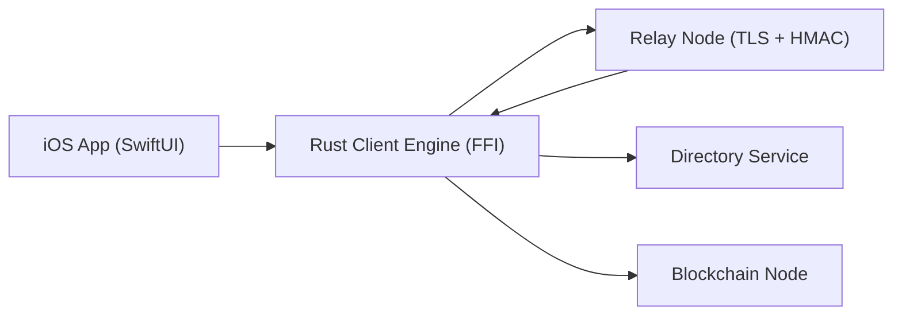

# System Design

For the expanded enterprise architecture package (requirements, scalability, databases, security, UML, roadmap), see [`docs/enterprise/README.md`](docs/enterprise/README.md).

## 1. Purpose
Redoor is a privacy-first messaging system that prioritizes:
- no centralized user verification authority
- memory-first (RAM) processing on clients
- minimum data retention in transport
- onion/mix routing for high-security delivery paths

The repository is a monorepo, but runtime architecture is service-oriented.

## 2. Architecture Overview
Redoor has five runtime planes:

1. `client/` (Rust): cryptographic runtime and message engine
2. `RedoorApp/` (Swift): iOS UI + lifecycle/security policy enforcement
3. `relay-node/` (Go): TLS relay with authenticated transport and ephemeral queues
4. `blockchain-node/` (Rust): tamper-evidence ledger for message commitments
5. `directory-dht/` (Rust): key publication and signed username resolution

## 3. Logical Topology

## 4. Major Design Decisions

### 4.1 Monorepo + Multi-Service Runtime
- Chosen structure: single repository for coordinated security gates and cross-language changes.
- Runtime remains separate services to preserve trust boundaries and independent scaling.
- Full microservice split beyond current boundaries is not required now; existing boundaries already match core domains (transport, evidence, directory, client runtime).

### 4.2 Security-by-Default Transport
- Relay TLS is mandatory in relay runtime.
- Optional HMAC request signing + anti-replay protects relay API calls.
- Receiver IDs are blinded before relay submission.
- Remote relay usage in iOS requires HMAC + pinning + onion nodes.

### 4.3 Ephemeral Client State
- Client engine keeps sessions/messages/attachments in memory structures.
- iOS app lock/background/duress paths trigger wipe flows.
- Relay normal blobs are fetch-once and deleted after retrieval.

### 4.4 Evidence Without Plaintext
- Blockchain node records message hash commitments and linkage metadata.
- Plaintext and ciphertext are not stored on-chain.

## 5. End-to-End Flow

### 5.1 Session Setup
1. Device creates identity keys and prekeys.
2. Peer bundle is exchanged/resolved.
3. X3DH + ratchet session is initialized in runtime memory.

### 5.2 Message Send/Receive
1. Sender serializes `InnerPayload`.
2. Payload is ratchet-encrypted into `Envelope`.
3. Envelope is sent to relay (direct or onion/mix route).
4. Receiver polls pending queue, decrypts in memory, and consumes message.
5. Sender submits hash evidence to blockchain.

### 5.3 Lifecycle Wipe
1. App transitions to background/resign/terminate or duress.
2. Swift service locks UI and disconnects.
3. Rust runtime wipe/duress handlers clear sensitive in-memory state.

## 6. Trust Boundaries
- Device boundary: plaintext should remain only in process memory.
- Relay boundary: relay is transport-only and untrusted for message content.
- Directory boundary: directory records must be verified (signed resolve response).
- Blockchain boundary: chain provides integrity evidence, not secrecy.

## 7. Runtime Configuration
Key environment controls:
- Relay: `RELAY_CERT_FILE`, `RELAY_KEY_FILE`, `RELAY_ADDR`, `RELAY_HMAC_KEY`
- Blockchain: `BLOCKCHAIN_HTTP_ADDR`, `BLOCKCHAIN_ADDR`, `BLOCKCHAIN_CERT_FILE`, `BLOCKCHAIN_KEY_FILE`, `ADMIN_TOKEN`
- Directory: `DIR_ADDR`, `DIR_TOKEN`, `DIR_SIGNING_KEY_HEX`, `DIR_REQUIRE_TLS`

## 8. Reliability and Quality Gates
- Security gates workflow (`.github/workflows/security-gates.yml`)
- Nightly reliability soak (`.github/workflows/reliability-nightly.yml`)
- Memory budget regression checks (`scripts/ci-memory-regression.sh`)
- Anonymity linkability regression gate (`scripts/ci-anonymity-regression.sh`)
- Realtime reconnect chaos test (`itest/tests/realtime_user_to_user.rs`)

## 9. Known Constraints
- Current design enforces strong volatile behavior in app/runtime paths, but some non-critical scaffolding modules remain in the Rust client codebase.
- Blockchain persistence is intentional and required for tamper evidence.
- Deployment hardening requires proper TLS/pinning/token setup; localhost defaults are for development only.

## 10. Advanced Security Roadmap
- additional state-level hardening targets (hybrid PQ, metadata resistance, endpoint hardening) are tracked in:
  - `docs/security/ADVANCED_MESSAGE_SECURITY.md`

## 11. Public Roadmap and Contributor Tracking
- Contributor roadmap: `docs/ROADMAP.md`
- Canonical status board: `docs/OPEN_SOURCE_STATUS.md`
- Security standards profile: `docs/security/STANDARDS_PROFILE.md`
- Contribution process: `CONTRIBUTING.md`
