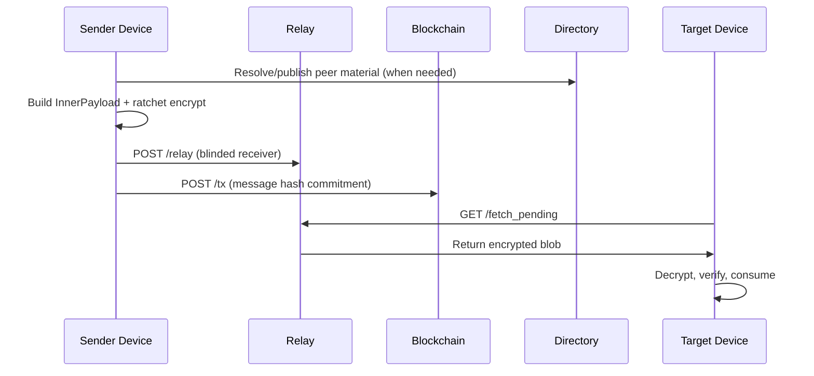
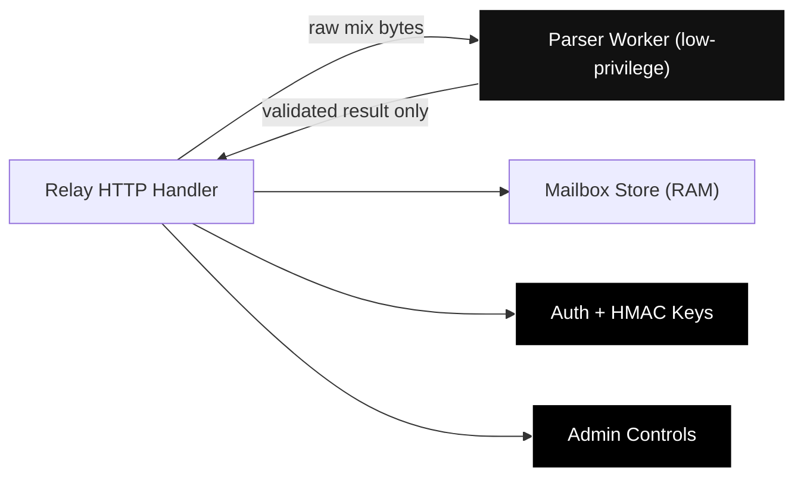

# Redoor Blueprint

This blueprint is the operational reference for how Redoor is built and how its pieces work together today.

## 1. Blueprint Goals
- keep user message content confidential end-to-end
- avoid centralized account verification dependencies
- enforce volatile client behavior (memory-first, wipe-capable)
- preserve tamper evidence for message commitments

## 2. System Composition

| Layer | Component | Runtime Role |
|---|---|---|
| Client Runtime | `client/` (Rust) | Key lifecycle, session ratchet, encryption, transport orchestration, FFI |
| Mobile App | `RedoorApp/` (Swift) | UX, policy checks, lifecycle wipe triggers, FFI consumption |
| Relay | `relay-node/` (Go) | TLS relay, HMAC/replay checks, fetch-once queue |
| Evidence | `blockchain-node/` (Rust) | Hash commitment ingestion, signature verification, chain persistence |
| Directory | `directory-dht/` (Rust) | Username/public-key publication and signed resolution |

## 3. End-to-End Message Blueprint

## 4. Security Blueprint

### 4.1 Core Controls
- per-message ratchet encryption and session counters
- receiver ID blinding toward relay
- relay HMAC/scoped-token auth + replay protection
- TLS pinning hooks in runtime and iOS integration
- strict anonymity mode to prevent non-onion fallback
- route diversity constraints and anti-correlation scoring (operator/jurisdiction/ASN memory) for mix path
- multi-relay split mailbox retrieval with deterministic de-dup and quorum policy
- cadence hardening with bounded jitter budgets and periodic phase-window randomization
- app lifecycle lock/wipe and duress wipe flows

### 4.2 Data Retention Expectations
- iOS/engine runtime: volatile process memory (wiped on lock/duress)
- relay normal queue: in-memory, deleted on successful fetch
- blockchain: persistent commitment ledger (by design)
- directory: in-memory key registry with signed resolve output

### 4.3 Relay Trust Boundary (Privilege Firewall)

- parser worker receives only allowlisted env capabilities required for mix parsing.
- authentication/admin secrets remain in main relay process and are not propagated to parser worker context.
- ingress parser path can only return validated envelope data; it cannot mutate relay key/session state.

## 5. Reliability Blueprint
- integration soak test: realtime delivery with reconnect chaos
- memory budget benchmark: populated vs post-wipe/post-duress regression
- anonymity linkability simulator + CI regression gate with versioned baseline artifacts
- cross-language quality gates in CI (Rust, Go, Swift, secrets)

## 6. Deployment Blueprint

### 6.1 Development
- local TLS cert + key for relay
- local blockchain HTTP endpoint
- local directory process
- iOS app or Rust client connected to local stack

### 6.2 Hardened/Remote
- remote relay over HTTPS with HMAC and pinning material
- directory TLS/token controls enabled
- blockchain secure mode with cert/key and admin token

## 7. Design Tradeoffs
- Monorepo improves coordinated hardening and CI coverage.
- Runtime remains split by trust boundary and scaling concern.
- Blockchain persistence is intentionally not RAM-only; it exists to preserve tamper-evidence history.

## 8. Roadmap Focus (Current)
- close remaining legacy/stub paths in Rust runtime
- keep lifecycle/duress regressions mandatory in CI
- expand deterministic integration testing around relay outage scenarios
- keep anonymity baseline thresholds strict and review every security milestone
- evaluate hybrid PQ session evolution and advanced metadata-resistance controls
- continue security baseline tightening without adding centralized identity authority

## 9. Related Documents
- `../SYSTEM_DESIGN.md`
- `../OO_DESIGN.md`
- `../DOMAIN_MODEL.md`
- `./architecture.md`
- `./protocol.md`
- `./threat_model.md`
- `./security-runbook.md`
- `./security/ADVANCED_MESSAGE_SECURITY.md`
- `./security/ZERO_CLICK_READINESS_RUNBOOK.md`
- `./security/AUTO_PROCESSING_LOCKDOWN.md`
