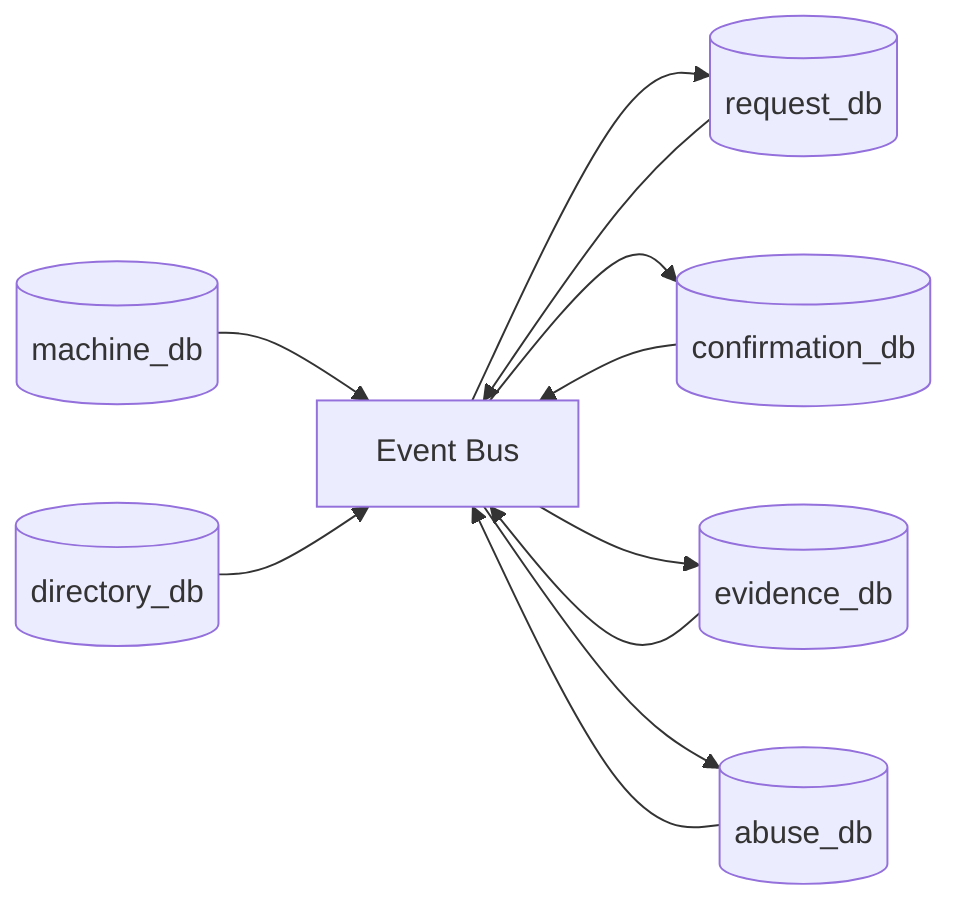

# Database Strategy, Scalability, and Performance Engineering

## 1. Database Strategy (Future Enterprise Topology)

The project can evolve into a **database-per-bounded-context** model while preserving privacy constraints.

### 1.1 Domain databases

| Domain | Database | Data Class | Retention |
|---|---|---|---|
| Machine inventory | `machine_db` | machine identity, capabilities, zone tags | long-lived |
| Request lifecycle | `request_db` | message delivery requests, status events | short/medium TTL |
| Delivery confirmation | `confirmation_db` | ack receipts, delivery proofs | short/medium TTL |
| Directory ownership | `directory_db` | username->pubkey seq/lease records | lease-driven |
| Relay transient queue | `relay_queue_db` (or in-memory grid) | opaque transport cells | ephemeral/fetch-once |
| Abuse/rate telemetry | `abuse_db` | counters, challenge events | short TTL |
| Evidence/ledger | `evidence_db` + blockchain file/state | hash commitments, proofs | long-lived |

Notes:
- Client device remains RAM-only for sensitive data.
- Transport payload remains opaque; no plaintext persistence.

### 1.2 Inter-database connectivity

Use event-driven integration instead of direct synchronous coupling:
- `request.created` -> `confirmation.expected`
- `delivery.succeeded` -> `confirmation.recorded`
- `commitment.submitted` -> `evidence.updated`

## 2. Data Modeling Principles

- immutable event records for delivery state changes;
- append-only audit trail for security-relevant events;
- strict PII minimization and partitioned keys;
- schema versioning with backward compatibility windows;
- TTL policies by data class.

## 3. Scalability Design

### 3.1 Horizontal scale approach
- stateless API layers behind load balancers;
- partitioned queues by receiver hash;
- read replicas for directory and evidence queries;
- region-aware routing for latency reduction.

### 3.2 Capacity tiers
- **Tier 1**: single region, active/passive backup.
- **Tier 2**: multi-AZ active/active relays.
- **Tier 3**: multi-region with geo-routing and async evidence replication.

## 4. Load Balancing

- L4 load balancing for TLS relay ingress.
- L7 balancing for API services (directory/blockchain admin APIs).
- consistent hashing for receiver mailbox stickiness where useful.
- health checks with circuit-breaking and outlier ejection.

## 5. Latency, Throughput, and Caching

### 5.1 Latency targets
- relay submit p95 < 120 ms regional.
- pending fetch p95 < 150 ms regional.
- directory resolve p95 < 80 ms.

### 5.2 Throughput controls
- token buckets by IP + receiver + service credential.
- queue backpressure with dynamic challenge mode.
- adaptive polling intervals for overload windows.

### 5.3 Caching strategy
- cache only non-sensitive records (public key metadata, health endpoints).
- avoid caching payload-bearing endpoints.
- use short TTL edge cache for static assets/docs only.

## 6. Protocols, CDNs, Proxies, and WebSockets

### 6.1 Protocol matrix
- current core: HTTPS (REST-like APIs).
- optional realtime evolution: WebSockets for low-latency pending notifications.
- internal service messaging: NATS/Kafka event bus.

### 6.2 Proxies/CDNs
- CDN is suitable for public static docs/web assets only.
- API gateways/proxies enforce authN, rate limits, schema checks, WAF.
- do not cache private messaging API responses at CDN edge.

### 6.3 WebSockets guidance
- use authenticated WebSocket channels for "new message available" events.
- still fetch opaque payload through authenticated API pull to preserve controls.

## 7. Distributed System Reliability

- idempotent commands for request creation and commit submission;
- at-least-once event delivery with deduplication keys;
- saga orchestration for multi-service state transitions;
- dead-letter queues with automated replay tooling.

## 8. Cost and Performance Optimization

- autoscale relay and directory separately based on queue depth and p95 latency;
- tiered storage: hot in-memory queues, warm short-lived DB partitions, cold compressed audit logs;
- reduce blockchain write amplification with batch commitments;
- use spot/preemptible nodes only for non-critical analytics workers;
- keep cryptographic hot paths in Rust for CPU efficiency.

## 9. Suggested Implementation Phases

1. Introduce event contracts and outbox pattern.
2. Split operational data stores by bounded context.
3. Add cross-service observability (traces, structured events, SLO dashboards).
4. Add regional federation with controlled failover drills.

