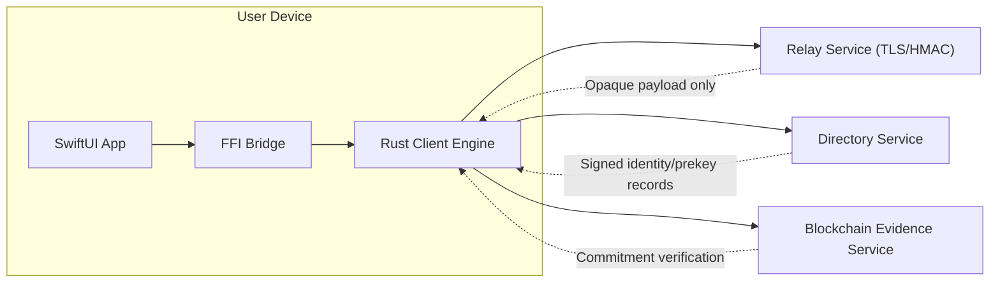
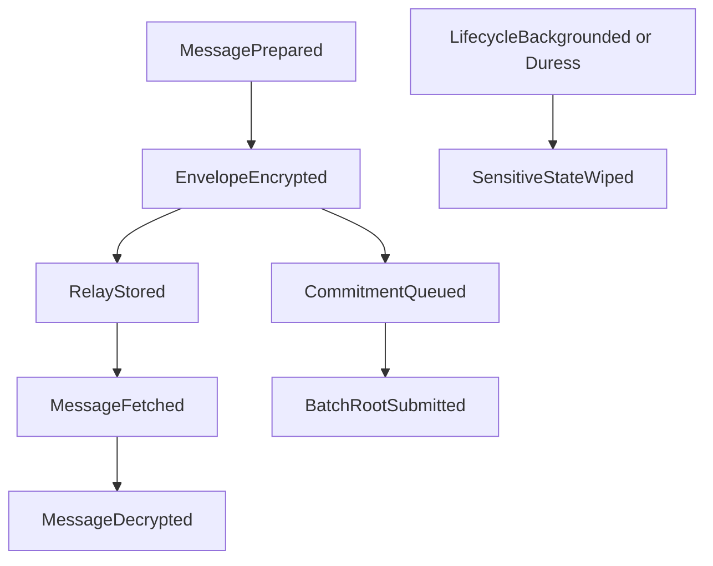

# Enterprise Architecture and High-Level Design

## 1. Context and Goals

Redoor is a privacy-first messaging platform with these core goals:
- keep message plaintext and key material in volatile memory on client devices;
- route traffic through untrusted infrastructure while minimizing metadata leakage;
- provide tamper evidence through commitments without exposing plaintext;
- preserve operational simplicity through a monorepo and strict CI gates.

## 2. High-Level Design

Redoor uses a service-oriented runtime with a monorepo governance model:
- **Client Runtime (Rust)**: cryptography, sessions, transport policies, FFI.
- **iOS Application (SwiftUI)**: UX, lifecycle wipe, secure configuration.
- **Relay Plane (Go)**: ephemeral transport queue, abuse controls, fetch-once.
- **Directory Plane (Rust)**: identity/public-key resolution and prekey TTL records.
- **Evidence Plane (Rust)**: blockchain-style hash commitments.

## 3. Architecture Style

### 3.1 Why not full microservices everywhere

Current boundaries already align to domains:
- transport plane (`relay-node/`),
- discovery plane (`directory-dht/`),
- evidence plane (`blockchain-node/`),
- client cryptographic plane (`client/`),
- presentation plane (`RedoorApp/`).

A deeper split into many smaller services would currently increase operational complexity and attack surface (service mesh policy, secret sprawl, more inter-service auth) without proportional security gain.

### 3.2 Recommended evolution model

- Keep current service boundaries.
- Introduce internal event contracts and stable APIs before any further split.
- Scale each domain independently with load-balanced replicas.

## 4. Project Structure

| Path | Domain | Responsibility |
|---|---|---|
| `client/` | Cryptographic runtime | Identity/prekeys, ratchet state, envelope build, relay client, FFI |
| `RedoorApp/` | iOS app | MVVM UX, lock/wipe/duress lifecycle, secure config validation |
| `relay-node/` | Transport | TLS relay API, anti-replay/HMAC, ephemeral queueing, abuse controls |
| `directory-dht/` | Discovery | Signed resolve responses, seq/lease ownership, prekey TTL |
| `blockchain-node/` | Integrity evidence | Commitment ingestion, signature verification, block linking |
| `itest/` | Reliability testing | realtime user-to-user and reconnect chaos tests |
| `scripts/` | Engineering controls | CI gates, security checks, memory regressions |

## 5. Event-Driven Architecture (EDA)

Redoor can be modeled as event-driven without changing the user-facing protocol:
- `MessagePrepared` -> `EnvelopeEncrypted` -> `RelayStored` -> `MessageFetched` -> `MessageDecrypted`.
- `CommitmentQueued` -> `BatchRootSubmitted` -> `ProofResolved`.
- `LifecycleBackgrounded` / `LifecycleDuress` -> `SensitiveStateWiped`.

## 6. Distributed System Design

### 6.1 Control planes
- **Data plane**: relay message cells and fetch responses.
- **Control plane**: key distribution, feature flags, abuse policies, health signals.
- **Evidence plane**: commitment storage and verification.

### 6.2 Key invariants
- Relay never needs plaintext.
- Directory cannot issue trusted records without signing key.
- Evidence plane stores commitments, not user content.
- Client refuses insecure remote configurations in secure mode.

## 7. Design Principles

- **Privacy by default**: safest behavior must be default behavior.
- **Fail closed**: secure mode refuses downgraded hardening.
- **Minimize persistence**: client plaintext and session state in RAM.
- **Explicit trust boundaries**: every network hop treated as potentially hostile.
- **Deterministic quality gates**: security checks are merge blockers.
- **Simple operational model first**: avoid premature service fragmentation.

## 8. Software Design Guidelines

- Separate domain concerns by bounded context (transport/discovery/evidence/runtime/UI).
- Keep APIs minimal and policy-driven (reject insecure options early).
- Prefer immutable message value objects and explicit state transitions.
- Model sensitive operations as idempotent, audited commands (wipe/duress/lock).

## 9. Architecture Risks and Mitigations

| Risk | Impact | Mitigation |
|---|---|---|
| Global traffic correlation | anonymity degradation | cover traffic, fixed-rate polling/sends, multi-hop relay routes |
| Service credential misuse | impersonation/abuse | short-lived credentials, rotation, scoped service tokens |
| Misconfigured TLS/pinning | MITM exposure | startup validation, CI checks, deployment policy tests |
| Availability concentration | outage blast radius | regional replicas, health-based routing, graceful degradation |

