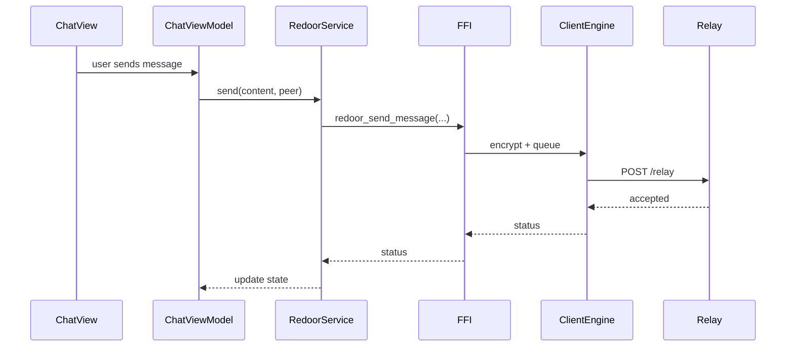
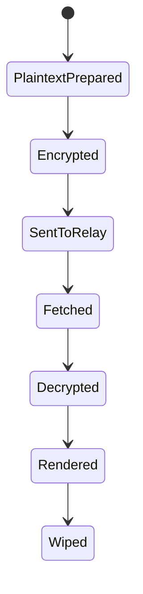
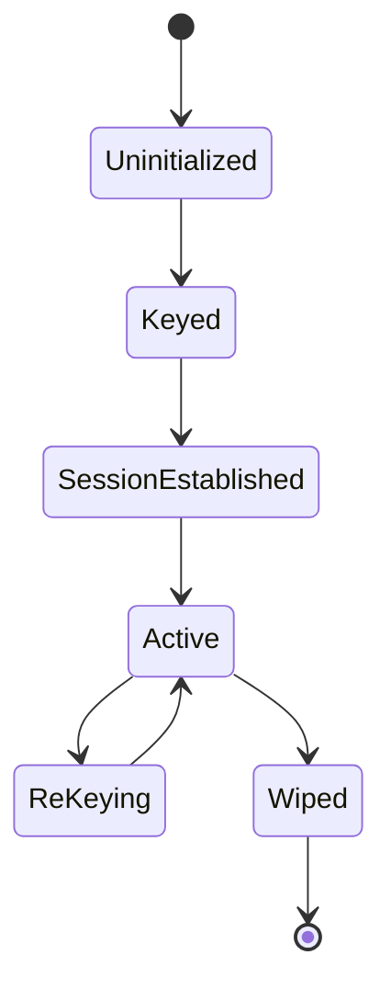

# Low-Level Design and OO Design

## 1. Low-Level Component Design

### 1.1 Client Engine (Rust)

Core modules:
- `engine.rs`: aggregate root (`ClientEngine`) and session/message state transitions.
- `service.rs`: policy orchestration (cover traffic, secure mode, wipe semantics).
- `network/relay.rs`: transport adapter (TLS/HMAC, receiver blinding, relay I/O).
- `ffi.rs`: stable C ABI boundary consumed by iOS.

Internal state categories:
- identity/prekeys;
- per-peer ratchet sessions;
- pending inbound/outbound queues;
- policy flags (strict anonymity, fixed intervals, batching);
- diagnostics and memory benchmark counters.

### 1.2 iOS App (Swift)

Core modules:
- `RedoorService`: facade for app-level operations.
- `ChatService`: UI-facing orchestration.
- `ChatViewModel`: view state and command handling.
- `SecureStorage`: volatile storage abstraction.
- lifecycle observers: background/resign/terminate/duress -> wipe/lock transitions.

### 1.3 Relay Node (Go)

Core modules:
- HTTP handlers for `relay`, `fetch`, `fetch_pending`, metrics.
- replay and HMAC validation middleware.
- adaptive abuse controls and per-IP/per-receiver quotas.
- in-memory store with TTL + fetch-once semantics.

## 2. OO Design (Cross-Language)

### 2.1 Principal objects and responsibilities

| Object | Responsibility | Key Constraints |
|---|---|---|
| `ClientEngine` | crypto runtime aggregate root | must keep sensitive state wipeable and bounded |
| `RedoorService` | iOS service facade | enforces safe policy before invoking FFI |
| `ChatViewModel` | user intent binding | no direct network/crypto logic |
| `RelayClient` | transport adapter | sender-side blinding, auth, validation |
| `EphemeralStore` | relay transport persistence | in-memory only for transient blobs |
| `BlockchainClient` | commitment submission/verification | never handles plaintext messages |
| `DirectoryClient` | signed record resolution | verify sequence/lease/signature invariants |

### 2.2 Object collaboration

## 3. Design Patterns in Use

- **Facade**: `RedoorService` wraps lower-level APIs.
- **MVVM**: SwiftUI view -> `ChatViewModel` -> services.
- **Adapter**: `RelayClient`, `DirectoryClient`, `BlockchainClient` map domain calls to protocol endpoints.
- **Aggregate Root**: `ClientEngine` controls mutation boundaries.
- **Policy Object/Strategy**: secure mode settings alter routing and timing behavior.
- **Repository-like store**: relay in-memory storage abstraction.
- **Observer**: lifecycle and reactive state updates.

## 4. LLD State Machines

### 4.1 Message lifecycle

### 4.2 Session lifecycle

## 5. API-Side LLD Contracts

### 5.1 Relay
- `POST /relay`: accepts opaque cell or envelope payload.
- `GET /fetch_pending?receiver=`: returns next queued blob.
- `GET /fetch?id=`: targeted retrieval.
- security headers may include HMAC timestamp + nonce.

### 5.2 Directory
- `POST /publish`: publish key record.
- `GET /resolve?username=`: signed ownership resolve.
- prekey endpoints carry TTL semantics.

### 5.3 Blockchain
- `POST /tx`: commitment submit.
- `POST /signed_block`: block append with signature validation.

## 6. Recommended LLD Improvements

- Introduce explicit interfaces/traits for all external clients to increase deterministic unit testing.
- Move all policy constants to typed configuration structs with validation.
- Add schema versioning to envelope serialization to support forward compatibility.
- Add domain events for critical state transitions (`wiped`, `locked`, `batch_submitted`).

