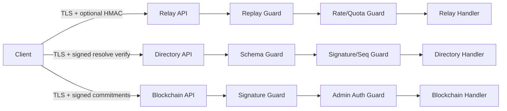

# API Design, Security Strategy, and Cybersecurity Blueprint

## 1. Security Objectives

- protect confidentiality of message content end-to-end;
- reduce metadata leakage and replay risk;
- enforce safe defaults and reject insecure runtime settings;
- detect tampering and preserve forensic integrity;
- make security controls testable and continuously enforced.

## 2. API Design Principles

- **Explicit contracts**: deterministic request/response schemas.
- **Versioned endpoints**: `/v1/...` for forward-safe evolution.
- **Idempotency where possible**: retries without duplicate side effects.
- **Minimal surface area**: only required operations exposed.
- **Policy gating**: auth, replay and rate checks before business logic.

## 3. API Security Controls by Service

| Service | Primary Controls | Additional Hardening |
|---|---|---|
| Relay | TLS, optional HMAC + nonce/timestamp, replay checks, abuse limits | request body size caps, receiver quotas, fixed-size cells |
| Directory | signed resolve responses, sequence/lease ownership, optional token | TLS requirement, strict schema checks, anti-automation guards |
| Blockchain | signed tx/block ingestion, admin token for privileged endpoints | endpoint-level rate limits, chain integrity verification |

## 4. Best-Practice Cybersecurity Implementation (Target State)

### 4.1 Zero trust service posture
- mTLS between all internal services.
- SPIFFE/SPIRE or workload identity for service authn/authz.
- short-lived credentials (hours, not days).
- policy-as-code for ingress/egress rules.

### 4.2 Key management
- server keys in HSM/KMS-backed storage.
- automatic key rotation and staged rollout.
- key compromise playbooks tested quarterly.

### 4.3 Secure SDLC
- mandatory code review + security checklist for all PRs.
- SAST + dependency + secrets scans as blocking checks.
- periodic threat model refresh tied to architecture changes.

### 4.4 Runtime hardening
- seccomp/AppArmor profiles for Linux deployments.
- immutable infrastructure for service images.
- strict outbound egress controls.

## 5. Performance Measures Security

Security must be measured like performance:

| Metric | Target |
|---|---|
| Replay rejection latency p95 | < 10 ms at relay ingress |
| HMAC verification failure ratio | < 0.1% normal traffic |
| TLS handshake failure ratio | < 0.5% steady-state |
| Vulnerability SLA (critical) | patch <= 24h |
| Mean time to security rollback | <= 15 min |
| Secret leak detection to revoke | <= 30 min |

## 6. Security Architecture Diagram

## 7. API Security Backlog (Actionable)

1. Add OpenAPI specifications and contract tests for relay/directory/blockchain APIs.
2. Introduce request/response schema validation middleware with strict mode.
3. Add signed API response envelopes for high-trust operations.
4. Add centralized key rotation and key usage telemetry.
5. Add automated chaos tests for replay and auth bypass attempts.

## 8. OpenPGP Position and Advanced Messaging Security

OpenPGP/PGP assessment for Redoor:
- useful for software-release signing and controlled operational channels;
- not preferred as the primary realtime message encryption protocol.

Why not primary for chat:
- weaker fit for modern ratchet-driven post-compromise recovery;
- higher operational key-management burden for mobile realtime messaging;
- does not solve metadata correlation by itself.

Preferred direction:
- retain ratchet-based messaging and evolve to hybrid PQ-capable session and key-update paths;
- keep metadata hardening (mix diversity including ASN constraints, decoys, constant-rate/phase randomization, mirrored relay fetches, anonymous credentials, regression gates) as first-class controls.

## 9. Compliance-Ready Logging Model

- log security events as structured JSON with trace IDs;
- never log plaintext/ciphertext/key material;
- log policy outcomes (allowed/denied/challenged) and reason codes;
- retain only required operational metadata with TTL and access control.
