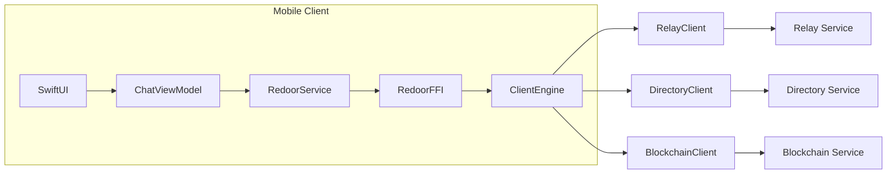
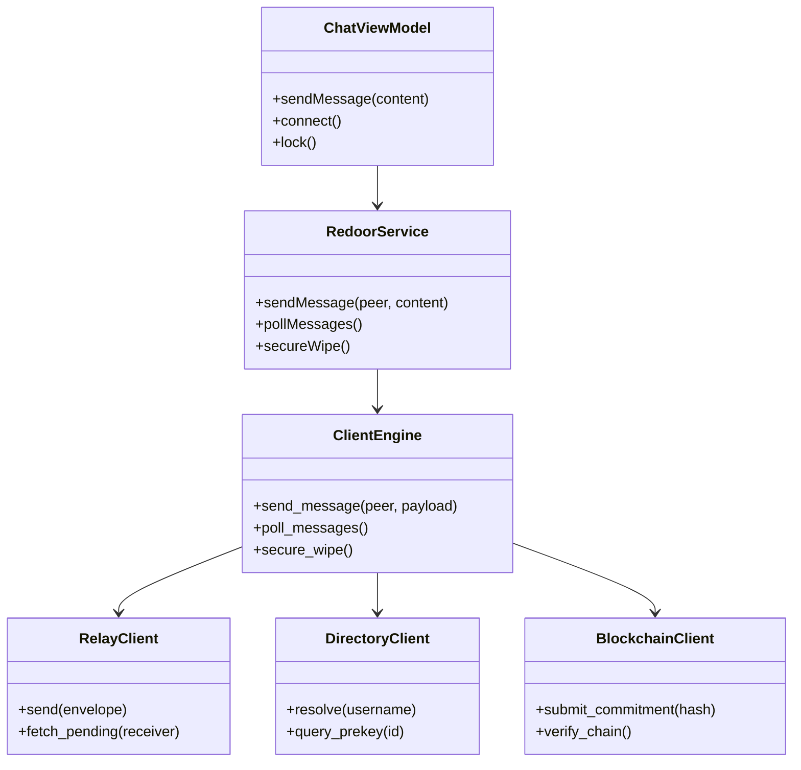
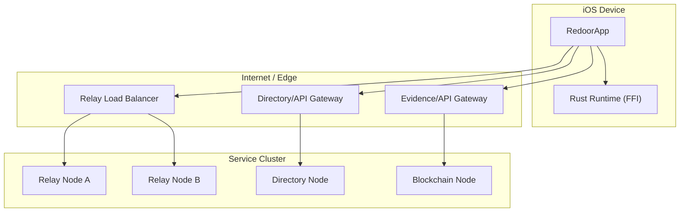
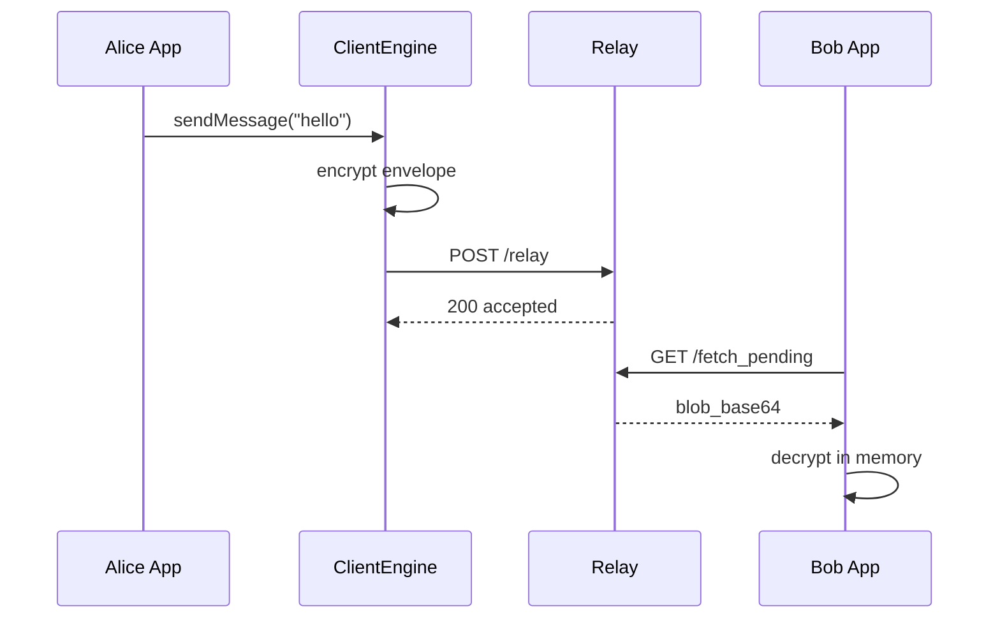
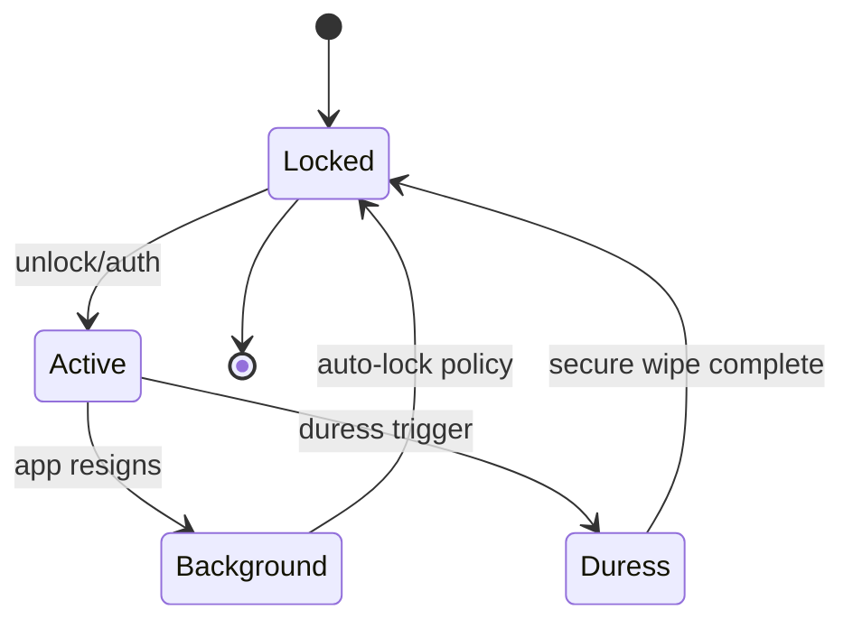

# UML Views

## 1. Component Diagram

## 2. Class Diagram (Conceptual)

## 3. Deployment Diagram (Logical)

## 4. Sequence Diagram (Message Delivery)

## 5. State Diagram (Client Security State)

